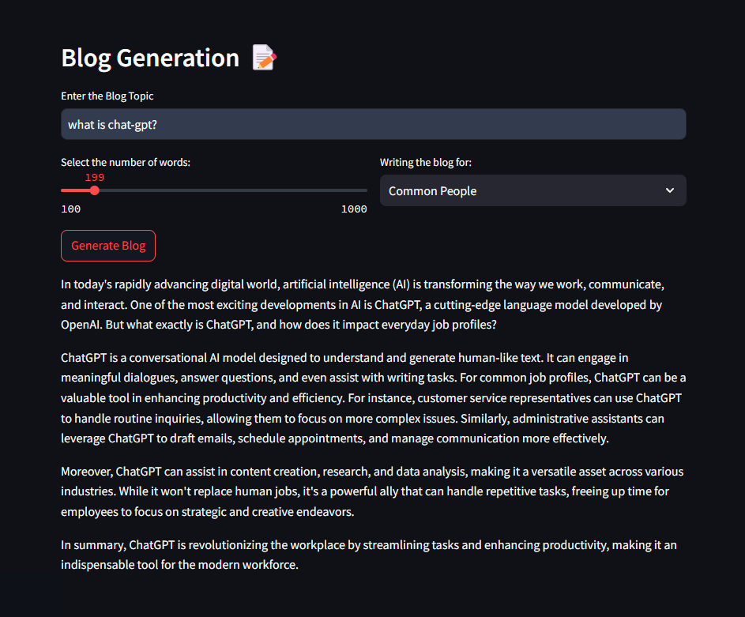

I have developed an app using the OpenAI API to generate blogs based on a given topic, desired word count, and job profile.

To use the app, simply fork the repository, download it, and run the command:

```
pip install -r requirements.txt
```

Next, obtain your OpenAI API key and add it to the `.env` file as:

```
OPENAI_API_KEY=<your_key_here>
```

Once this is done, you can run the app with the following command:

```
streamlit run app.py
```

Below is a screenshot showing the output generated by Streamlit.  

